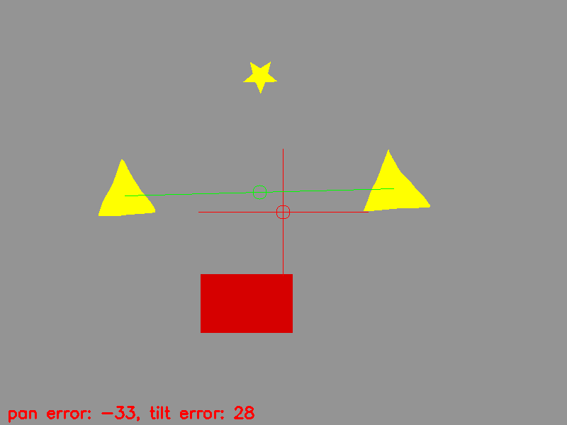

# OpenCV Class Project
Track the position of the midpoint between two yellow triangles relative to the center of the frame. Pan and tilt errors indicate the amount of pixels away from the center.

## Input image

## Binary image containing yellow

## Image processing
1. Convert the input image into the HSV colorspace
2. Use a threshold to filter out everything but yellow
3. Get the contours of the remaning closed shapes
4. Find exactly 2 triangles out of those shapes
5. Calculate the momentum of the triangles to get the center point of each
6. Use those two points to find the midpoint between the two

